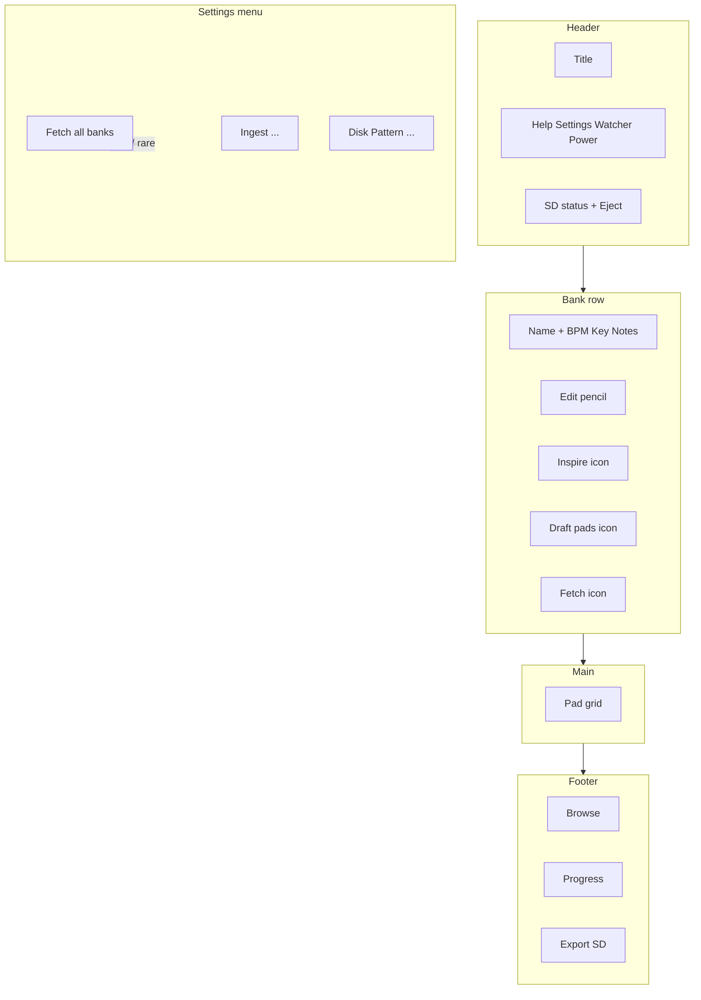

# Holistic Jambox UI: stepped vibe workflow + iconic chrome

**Status:** Design / review (not yet implemented)

**Purpose:** Shareable plan for bank-level vibe UX, header/footer chrome, and SD eject. Includes a schema audit against the current repo.

---

## Summary

- Replace the separate “Describe a vibe…” bar with a **three-step bank toolbar**: Inspire (LLM bank copy) → Draft pads (LLM pad strings, no library fetch) → Fetch samples (pipeline only).
- **Footer:** keep Browse, progress, Export; move **Fetch All Banks** into Settings.
- **Header:** SD status + **Eject**; optional pass to unify icon buttons; optionally move **Card Intel** next to SD.
- **New API:** `POST /api/vibe/inspire-bank` (narrow JSON: name, notes, bpm, key).
- **New API:** `POST /api/sdcard/eject` (macOS `diskutil eject` on configured volume).

---

## Implementation checklist (todos)

| ID                     | Task                                                                                                                                                                                                                                                                                                                                                          |
| ---------------------- | ------------------------------------------------------------------------------------------------------------------------------------------------------------------------------------------------------------------------------------------------------------------------------------------------------------------------------------------------------------- |
| inspire-api            | Add `POST /api/vibe/inspire-bank` (optional seed genre); LLM returns `name`, `notes`, `bpm`, `key` JSON; apply via `PUT /api/banks/<letter>`; helper in `scripts/vibe_generate.py` or adjacent                                                                                                                                                                |
| bank-toolbar-icons     | Remove `#vibe-panel`; add three icon buttons next to bank edit; Draft uses `generate-fetch-bank` with `fetch: false`; merge `bpm`/`key` from `bank_config` (server or client); **preserve bank `notes`/`name` after `load_preset_to_bank`**; Fetch uses `POST /api/pipeline/fetch` with `{ bank }` only; disable actions while the other job class is running |
| footer-settings-rehome | Move Fetch All into `#settings-menu`; trim footer                                                                                                                                                                                                                                                                                                             |
| header-sd-cluster      | Eject icon + confirm modal + `POST /api/sdcard/eject`                                                                                                                                                                                                                                                                                                         |
| header-icon-pass       | Consistent `header-icon-btn` tooltips / grouping                                                                                                                                                                                                                                                                                                              |
| cleanup-dead-vibe-js   | Remove vibe-bar-only JS; update tutorial copy                                                                                                                                                                                                                                                                                                                 |

---

## Can the LLM do this?

**Yes, with a split pipeline.**

1. **Inspire** — Small task: strict JSON `{ name, notes, bpm, key }` from optional seed or “surprise me.”
2. **Draft pads** — Already supported: `_run_populate_bank` skips fetch when `prompt_data["fetch"]` is false (`web/api/vibe.py`). Use `**POST /api/vibe/generate-fetch-bank`** with `fetch: false` (preferred over `populate-bank` so an empty prompt can fall back to `_build_metadata_prompt`).
3. **Fetch** — `POST /api/pipeline/fetch` with body `{ "bank": "<letter>" }` for current bank only.

Manual path: edit bank modal, then Draft and/or Fetch only.

---

## Information architecture

---

## UX details

### Bank toolbar (replaces vibe bar)

| Control    | Step | Behavior                                                                                               |
| ---------- | ---- | ------------------------------------------------------------------------------------------------------ |
| Inspire    | 1    | Optional popover: genre seed + “Surprise me” → inspire API → `PUT` bank → refresh UI                   |
| Draft pads | 2    | `generate-fetch-bank` with `fetch: false`, `bank` = current; poll `/api/vibe/populate-status/<job_id>` |
| Fetch      | 3    | `POST /api/pipeline/fetch` with `{ bank: currentLetter }`                                              |

- Disable Draft when `notes` is empty (or toast).
- Remove `#vibe-panel` entirely.

### Footer

- Move **Fetch All Banks** to `#settings-menu`.
- Keep **Browse**, **progress**, **Export to SD**.
- **Card Intel:** footer vs header next to SD (implementation choice).

### Header — SD + eject

- `POST /api/sdcard/eject`: `diskutil eject` on `SD_CARD` from config; only when mounted; confirm dialog in UI.

---

## Files to touch (expected)

- `web/templates/index.html`
- `web/static/js/app.js`
- `web/static/css/style.css`
- `web/api/vibe.py` — `inspire_bank` route
- `web/api/sdcard.py` — `eject` route
- `scripts/vibe_generate.py` — inspire helper + JSON validation

---

## Schema and integration audit (current codebase)

### `PUT /api/banks/<letter>`

`web/api/banks.py` accepts: `name` (string), `bpm` (integer or null), `key` (string or null), `notes` (string). Inspire must coerce `bpm` to int before PUT.

### Step 2: prefer `generate-fetch-bank` over `populate-bank`

- `/vibe/populate-bank` requires non-empty `prompt`.
- `/vibe/generate-fetch-bank` can omit `prompt` and use `_build_metadata_prompt`.

**Critical — `bpm` / `key` in `prompt_data`:** `build_bank_from_vibe` uses `prompt_data.get("bpm") or 120` and `prompt_data.get("key") or "Am"`. If the HTTP body omits them, the LLM path defaults to **120 / Am** even when YAML differs. **Fix:** client always sends current bank `bpm`/`key`, or server merges from `bank_config` before building `prompt_data`.

### Step 2: `load_preset_to_bank` overwrites bank-level fields

`scripts/preset_utils.py` `load_preset_to_bank` replaces the whole bank entry with preset `name`, `bpm`, `key`, `notes`, `pads`. Vibe presets use short names and `rationale` for notes — **this wipes long-form bank notes from Inspire unless we preserve them.** Implement merge or post-load restore of `notes` (and optionally `name`) in the same change set as Step 2.

### Step 3: pipeline fetch

`POST /api/pipeline/fetch`: optional `bank`, optional `pad`; empty body = all banks.

**Concurrency:** Vibe jobs (`_vibe_jobs`) and pipeline fetch (`_jobs`) use different locks — they do not block each other. Avoid overlapping draft + fetch on the same bank (UI gating).

### SD eject

Config: `SP404_SD_CARD` / `app.config['SD_CARD']` (see `scripts/jambox_config.py`). Use volume mount path with `diskutil eject`.

### Today’s “Generate/Fetch Bank”

Footer button runs full `generate-fetch-bank` with `fetch: true`, not pipeline-only fetch. If removed from footer, consider a Settings shortcut “Generate + fetch current bank” for power users.

---

## Out of scope (unless expanded)

- Pattern generation / ingest rewrites
- PTN / PAD_INFO
- Non-macOS eject (document no-op or omit)

---

## Risks

- Eject needs permission to run `diskutil` on the host.
- **Preset load clobbering notes** is the highest-risk UX bug; fix alongside Step 2.

